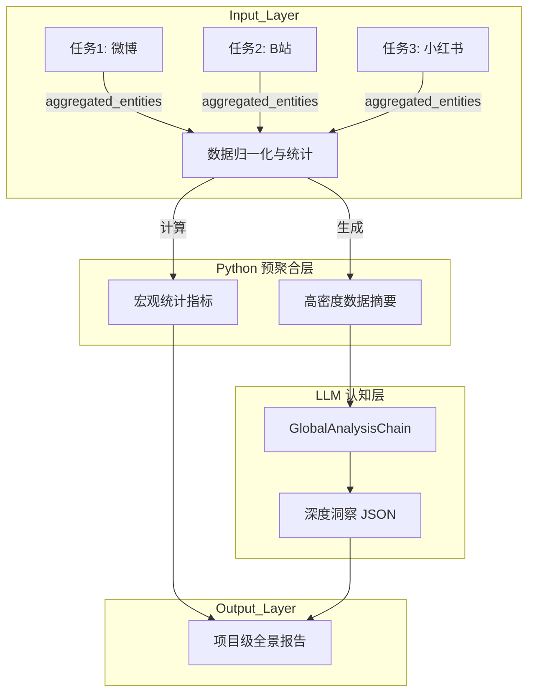

# 项目级多任务整合分析方案 (Project-Level Analysis Scheme)

## 1. 核心理念：LLM 驱动的全局融合 (LLM-Driven Global Fusion)

在**“多平台 + 单关键词 + 多任务”**且**“单任务小样本 (50-100篇)”**的约束条件下，项目级分析的核心目标是**消除单平台/单次采样的偏差，还原全网真实舆情画像**。

单纯的统计聚合无法处理复杂的跨平台语义和观点冲突，本方案采用**“程序预聚合 + LLM 认知分析”**的混合架构：
- **程序层 (Python)**：负责数据的归一化、去重、加权统计，生成“高密度数据摘要”。
- **认知层 (LLM)**：负责阅读摘要，识别跨平台共识/分歧，进行归因分析，并生成策略建议。

---

## 2. 架构流程图



---

## 3. 详细步骤设计

### 3.1 步骤一：程序化预聚合 (Pre-Aggregation)

将分散的任务数据压缩为 LLM 可理解的上下文。

*   **输入**：选定任务的 `aggregated_entities` 和 `aggregated_opinions`。
*   **处理逻辑**：
    1.  **平台归一化**：计算各平台的声量权重，避免高互动平台（如B站）淹没低互动平台。
    2.  **实体对齐**：基于 `canonical_name` 合并实体，保留 `platform_distribution`（平台来源分布）。
    3.  **Top 提取**：按加权热度提取 Top 20 实体和 Top 30 观点。
    4.  **摘要生成**：生成 Prompt Context。

*   **Prompt Context 示例**：
    ```text
    【全网概览】总声量: 45000, 涉及平台: 微博(40%), B站(30%), 小红书(30%)
    【核心实体 (Top 5)】
    1. "价格": 热度 12000, 情感 -0.9 (全网痛点). 来源: 微博(50%), B站(40%). 主要观点: "定价过高", "割韭菜".
    2. "外观": 热度 8000, 情感分化. 来源: 小红书(正面, "高级感"), B站(负面, "塑料感").
    ...
    ```

### 3.2 步骤二：LLM 认知分析 (Cognitive Analysis)

调用 `GlobalAnalysisChain` 进行深度推理。

*   **分析维度 1：共识与分歧 (Consensus & Divergence)**
    *   **目标**：识别全网公认的优缺点，以及平台间的认知割裂。
    *   **逻辑**：如果实体情感在所有平台一致 -> **共识**；如果情感极性相反 -> **分歧**。
*   **分析维度 2：舆情归因 (Attribution)**
    *   **目标**：推断负面舆情的根本原因（产品缺陷 vs 运营失误）。
*   **分析维度 3：策略建议 (Strategic Advice)**
    *   **目标**：针对不同平台属性提出差异化建议。

### 3.3 步骤三：结果组装 (Result Assembly)

最终存储在 `DataProject.analysis_result` 中的数据结构：

```json
{
  "metrics": {
    "total_volume": 45000,
    "global_sentiment": -0.2,
    "platform_ratios": {"weibo": 0.4, "bilibili": 0.3, "xhs": 0.3}
  },
  "insights": {
    "summary": "本周舆情总体偏负面，核心矛盾集中在定价策略...",
    "consensus": [
      {
        "topic": "续航",
        "sentiment": "negative",
        "description": "全平台用户一致反映续航尿崩，是核心劝退点"
      }
    ],
    "divergence": [
      {
        "topic": "外观",
        "platforms": ["小红书(正)", "B站(负)"],
        "analysis": "审美取向差异导致评价两极化"
      }
    ],
    "suggestions": [
      {"platform": "Weibo", "action": "加强公关引导..."},
      {"platform": "Bilibili", "action": "发布硬核评测视频..."}
    ]
  },
  "charts": {
    "entity_venn": [ ... ], // 韦恩图数据：展示共识/独有话题
    "sentiment_radar": [ ... ] // 雷达图：各平台情感倾向
  }
}
```

---

## 4. 关键价值点

1.  **弥补小样本缺陷**：利用 LLM 的语义泛化能力，将不同表述（"费电" vs "续航差"）聚合，变相增加样本密度，提高结论置信度。
2.  **透视平台差异**：不仅知道"全网怎么样"，还能清晰看到"微博和B站吵在哪"，为精细化运营提供依据。
3.  **可解释性**：输出人类可读的定性分析报告，而非冷冰冰的数字堆砌。

---

## 5. 开发排期建议

1.  **Phase 1 (Python)**: 实现 `ProjectAggregator` 类，完成数据的归一化和摘要生成。
2.  **Phase 2 (LLM)**: 开发 `GlobalAnalysisChain`，调试 Prompt 以稳定输出 JSON。
3.  **Phase 3 (Frontend)**: 开发项目级分析页面，展示 "全景图表 + 智能报告"。

