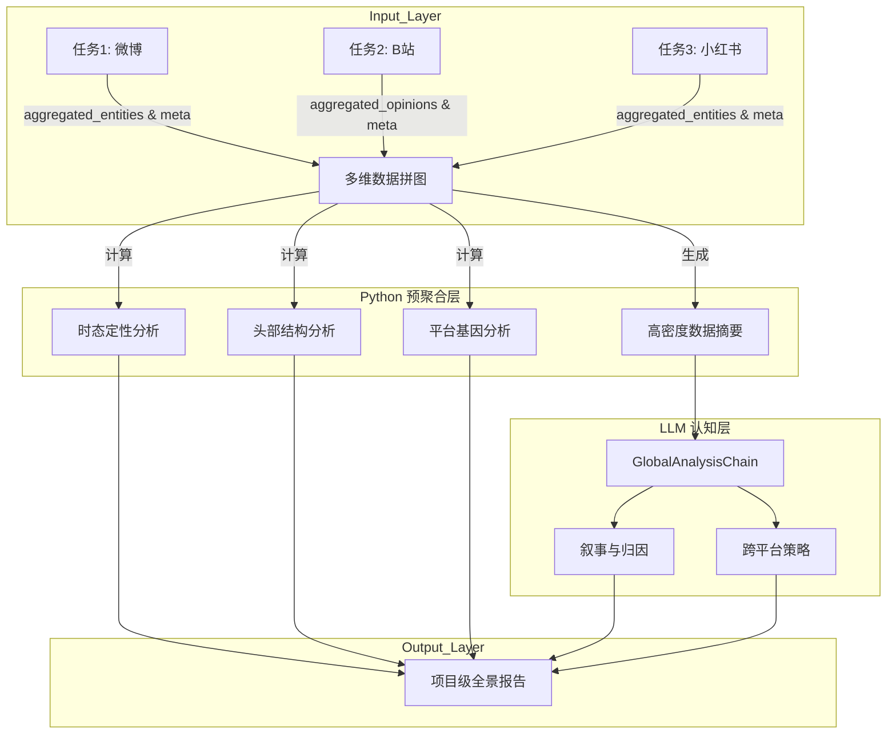

# 项目级多任务整合分析方案 (Project-Level Analysis Scheme)

> 工程细化版（含：默认全量 + 可选过滤层 + 项目级归一化字典）详见：
> `docs/analysis_design/PROJECT_ANALYSIS_DETAIL.md`

## 1. 核心理念：小样本下的全景拼图 (Puzzle Assembly with Small Data)

在**“多平台 + 单关键词 + 多任务”**且**“单任务小样本 (Top 50-100篇)”**的约束条件下，项目级分析必须正视数据的**稀疏性**和**偏差性**。我们不能通过 Top 100 数据拟合全网的连续趋势，而是应该通过**跨平台拼图**来还原舆情的**“当前状态”**和**“结构特征”**。

本方案采用**“程序预聚合 + LLM 认知推理”**的混合架构：
- **程序层 (Statistical Assembly)**：放弃微观趋势拟合，专注于**宏观结构统计**（如平台基因差异、头部内容构成、时态分布）。
- **认知层 (Cognitive Inference)**：利用 LLM 强大的语义泛化能力，弥补小样本的统计缺陷，进行**归因分析**和**策略生成**。

---

## 2. 架构流程图



---

## 3. 详细步骤设计

### 3.1 步骤一：程序化预聚合 (Pre-Aggregation)

将分散的任务数据重新组织为描述“舆情结构”的指标，而非简单的累加。

#### A. 舆情时态判定 (Temporal State Classification)
*   **目标**：判断当前舆情处于什么生命周期阶段。
*   **输入**：所有任务的 `freshness` 数据（Last 7/30 days count）。
*   **逻辑**：
    *   **爆发期 (Outbreak)**：> 70% 内容发布于近 3 天 → 突发热点，需紧急介入。
    *   **发酵期 (Fermenting)**：内容均匀分布在近 30 天 → 问题持续，需产品改进。
    *   **长尾期 (Long-tail)**：> 60% 内容发布于 30 天前 → 历史遗留或经典话题。

#### B. 头部内容结构 (Top Content Structure)
*   **目标**：分析占据舆论焦点的帖子性质（新晋爆款 vs 常青树）。
*   **输入**：Top 帖子列表（含 `published_at` 和 `CII`）。
*   **逻辑**：构建**生命周期矩阵**（X轴：存活天数，Y轴：当前热度）。
    *   **新晋爆款**：发布时间短 + 高热度。
    *   **常青树**：发布时间长 + 高热度（代表核心认知）。

#### C. 平台基因图谱 (Platform DNA Mapping)
*   **目标**：量化不同平台对同一话题的关注度差异。
*   **输入**：`aggregated_opinions` (按平台拆分权重)。
*   **逻辑**：计算各维度的**平台偏离度**。
    *   *示例：B站用户极度关注“性能”（权重占比 60%），小红书用户极度关注“外观”（权重占比 70%）。*

### 3.2 步骤二：LLM 认知分析 (Cognitive Analysis)

调用 `GlobalAnalysisChain`，利用语义理解能力填补统计空白。

#### D. 叙事转移与归因 (Narrative Shift & Attribution)
*   **Prompt 目标**：对比“近期内容”与“早期内容”的摘要，识别焦点转移。
    *   > "分析最近 7 天的高热内容与 30 天前的内容相比，讨论焦点发生了什么变化？是新产品发布引发了新的吐槽？还是旧问题已被解决？"

#### E. 跨平台策略生成 (Cross-Platform Strategy)
*   **Prompt 目标**：基于平台基因差异提出针对性建议。
    *   > "针对 B 站用户关注性能的特点，建议发布硬核评测；针对小红书关注外观的特点，建议加强场景化种草。"

---

## 4. 数据结构定义 (`DataProject.analysis_result`)

```json
{
  "temporal_state": {
    "status": "Fermenting",  // Outbreak / Fermenting / Long-tail
    "freshness_score": 0.45, // 近7天内容占比
    "description": "舆情处于持续发酵期，全网讨论均匀分布在近一个月，非突发事件。"
  },
  "top_content_structure": {
    "new_hits_count": 12,    // 新晋爆款
    "evergreen_count": 5,    // 常青树
    "classic_issues": ["价格贵", "散热差"] // 常青树里的共性问题
  },
  "platform_dna": {
    "dimensions": ["性能", "外观", "价格", "服务"],
    "data": {
      "bilibili": [0.8, 0.2, 0.6, 0.1],
      "xhs": [0.1, 0.9, 0.3, 0.5]
    }
  },
  "narrative_analysis": {
    "trend": "焦点转移",
    "from": "发布初期的期待 (Last Month)",
    "to": "到手后的散热吐槽 (Last Week)",
    "reason": "用户开始收到真机，实际体验与宣传不符"
  },
  "strategy_suggestions": [
    {"platform": "Bilibili", "action": "发布硬核散热测试视频进行辟谣或解释"},
    {"platform": "Weibo", "action": "加强客服响应，处理发货延迟投诉"}
  ],
  // 依然保留全局融合数据供前端展示
  "global_entities": [...],
  "global_opinions": [...]
}
```

---

## 5. 关键价值点

1.  **少算数，多看图**：不强行拟合无意义的时间曲线，而是展示“时态”和“结构”。
2.  **重推理**：利用 LLM 解决小样本下“统计不显著”的问题，通过语义分析提取洞察。
3.  **平台差异化**：将“多平台”从单纯的数据源变成分析维度，揭示不同舆论场的特性。

---

## 6. 开发排期建议

1.  **Phase 1 (Python)**: 实现 `ProjectAggregator`，重点完成**跨平台实体/观点融合**和**时态/结构指标计算**。
2.  **Phase 2 (LLM)**: 开发 `GlobalAnalysisChain`，调试 Prompt 以支持**叙事对比**和**策略生成**。
3.  **Phase 3 (Frontend)**: 开发项目级大屏，展示雷达图（平台基因）、矩阵图（生命周期）和智能报告。
